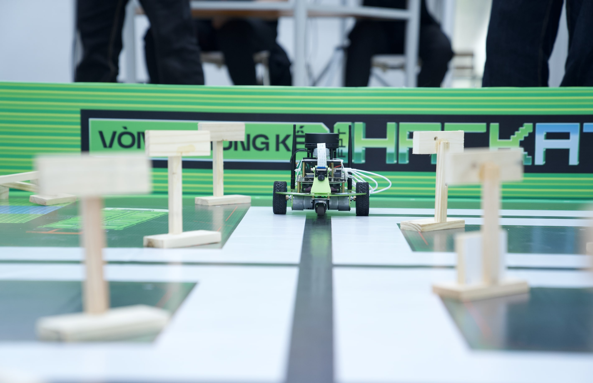
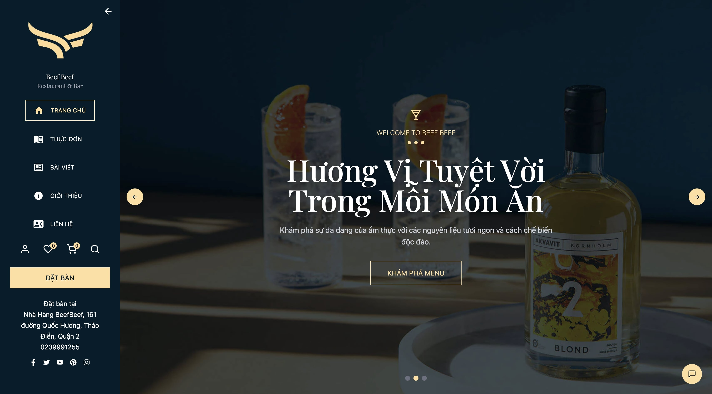
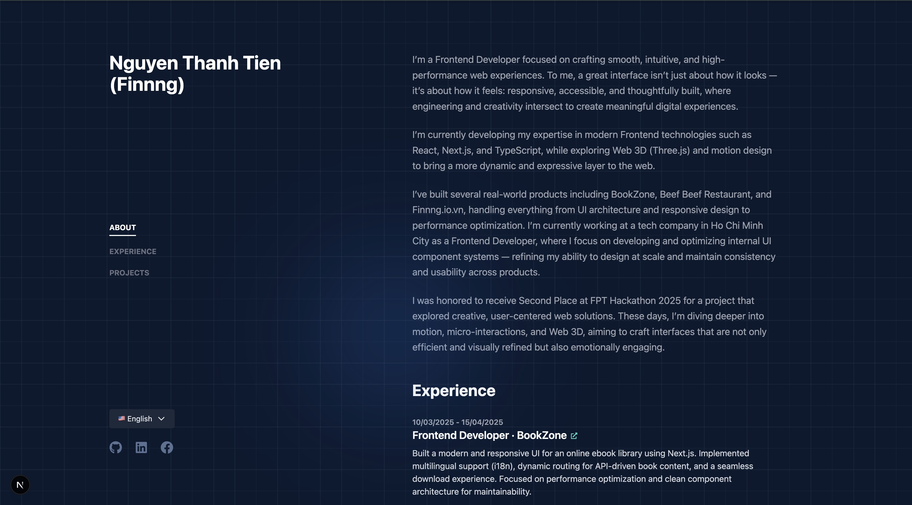

  

   
  <h3>Hi there, I'm Nguyễn Thanh Tiến! </h3>

<h3 align="center">
  🎨 Frontend Developer • Creative Developer • Web Enthusiast
</h3>

 

  --- 

  
  ### About Me
  
I’m a Frontend Developer focused on crafting smooth, intuitive, and high-performance web experiences.
  To me, a great interface isn't just about how it looks — it's about how it feels: 
  **responsive, accessible, and thoughtfully built.**

  Right now, I'm developing expertise in **React, Next.js, and TypeScript**, 
  while  exploring Web 3D and Motion Design to level up UI interaction.
 

 

  

  
  I’m currently contributing to the frontend of a <strong>Cryptocurrency Exchange platform</strong> (focusing on UI & Transaction flows).

  
  I’m currently deep diving into <strong>React.js</strong> and <strong>TypeScript</strong>.

  
  Achievement: <strong>Runner-up at FPT Hackathon 2025</strong>.

  
  I’m looking for: <strong>Junior Frontend opportunities</strong>.

  
  Fun fact: <strong>I can center a <code>div</code> in 3 different ways!</strong> 

  --- 

### Tech Stack & Tools

<!-- Main -->

  
  
  

<!-- Frontend -->

  
  
  
  
  

<!-- Backend -->

  
  
  
  
  

<!-- Tools -->

  
  
  

  --- 

  <h3>Featured Project</h3>
  <i>Here are some of the projects I'm proud of:</i>
    

### Autonomous Driving Car
*(Runner-up at FPT Hackathon 2025)*

 

- **Overview:** Developed an intelligent autonomous vehicle system capable of pathfinding and obeying traffic rules on a simulated map.
- **Key Features:**
  - **Pathfinding:** Optimized route planning using **BFS/DFS algorithms** based on coordinate data.
  - **Computer Vision:** Trained AI models for real-time **Traffic Sign Recognition**.
  - **Embedded Control:** Handled motor control and sensor signal processing.
- **Tech Stack:** C++, Python, OpenCV, **Arduino (Embedded)**, **Raspberry Pi (Linux)**.
- **Status:** *Hardware Project (Offline Competition)*

 
---
 

### BeefBeef Restaurant & Bar
*(Graduation Thesis / Capstone Project)*

 

- **Overview:** A comprehensive full-stack restaurant management system, streamlining operations from Table Reservation to Inventory Management.
- **My Contributions (Frontend Lead):**
  - **System Design:** Designed Database schema & Frontend architecture/folder structure.
  - **UI/UX Design:** Created high-fidelity prototypes using **Figma** ensuring responsive design.
  - **Full-stack Dev:** Implemented end-to-end features: **Advanced Search, Filter, Pagination**, and Wishlist logic.
- **Tech Stack:** React.js, Node.js, Express, MongoDB, Figma.
- **Links:** [Live Demo](https://beefbeefrestaurant.io.vn/) • [Source Code](https://gitlab.com/graduationproject3900751/BeefBeef-Restaurant)

 
---
 

### Finnng's Digital Space
*(Personal Portfolio & Playground)*

 

- **Overview:** A modern, high-performance personal website designed to showcase my projects and technical journey. Focuses on **minimalist aesthetics**, **clean code structure**, and **SEO optimization**.
- **Key Features:**
  - **UI/UX:** Dark/Light mode toggle, Fully Responsive layout for all devices.
  - **Performance:** 100/100 Lighthouse score, Server-side Rendering (SSR) with Next.js.
  - **Showcase:** Central hub for projects and blogs.
- **Tech Stack:** Next.js, TypeScript, Tailwind CSS.
- **Links:** [Live Demo](https://finnng.io.vn/) • [Source Code](https://github.com/Finnng1104/portfolio)

  --- 

  <h3>GitHub Stats</h3>
  

    
    
  

  --- 

 <h3>Connect with me</h3>

 

